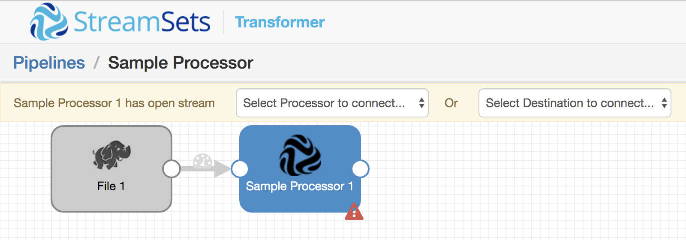
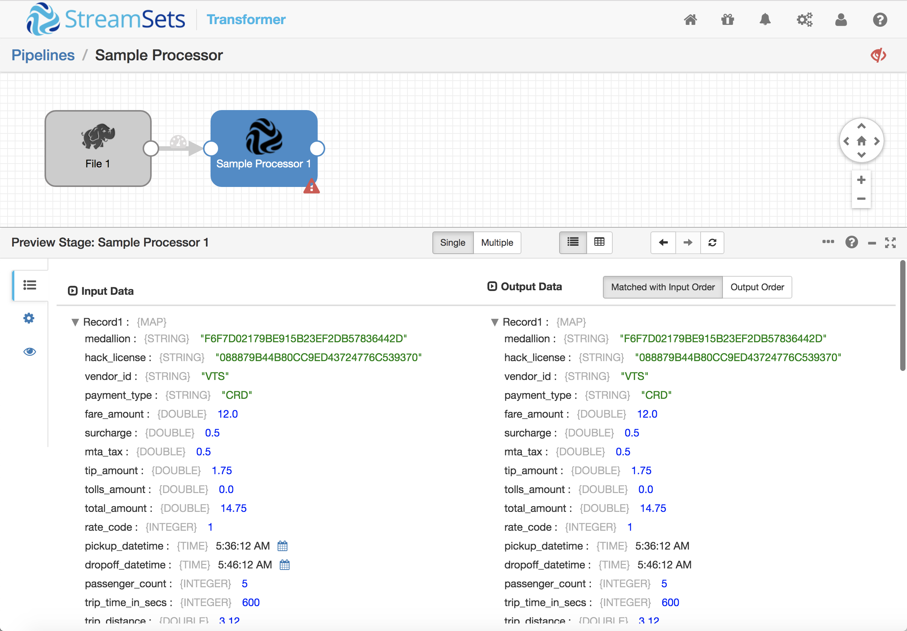
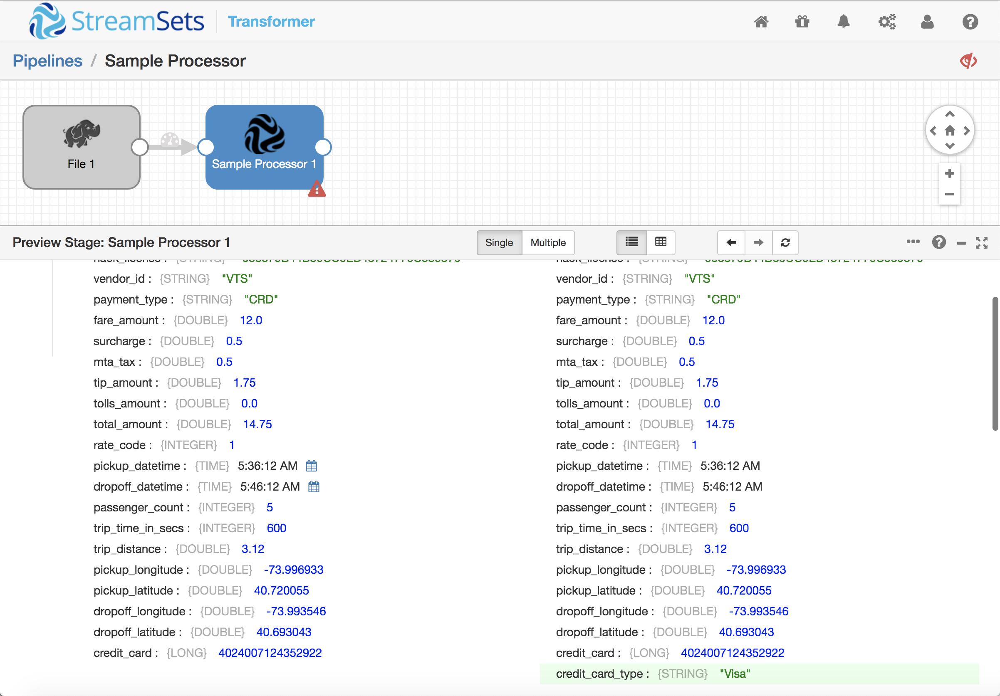
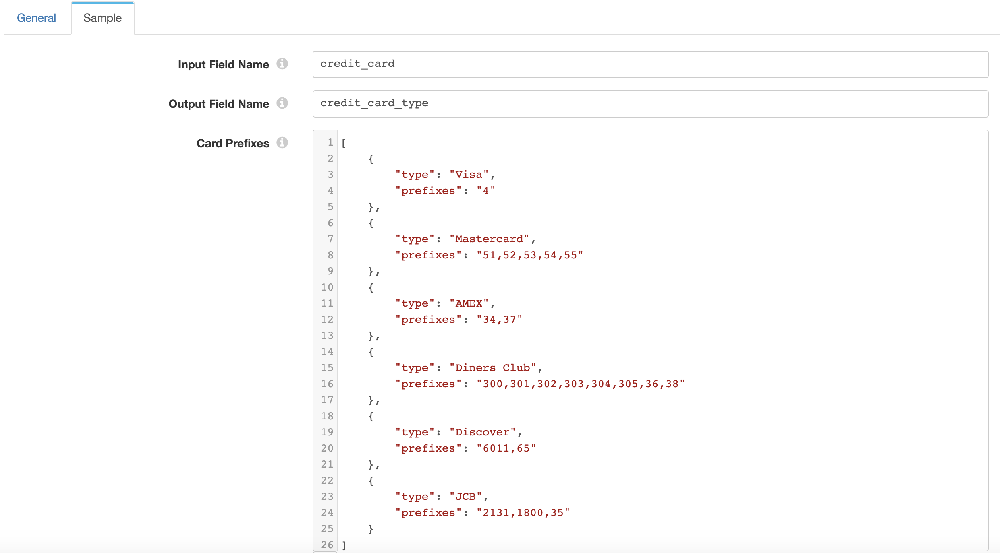
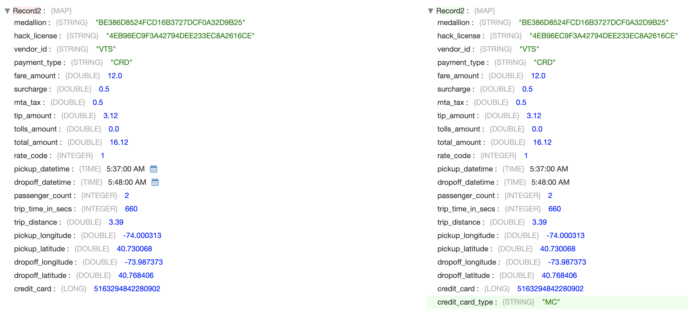

Creating a Custom Processor for StreamSets Transformer
======================================================

StreamSets Transformer combines the power of Apache Spark with the ease of use of StreamSets' award winning Data Collector. You can build dataflow pipelines that aggregate data across time, join incoming streams of data, and scale across your Spark cluster. Processors are the core of Transformer's pipelines, implementing operations on Spark DataFrames.

This tutorial explains how to create a simple custom processor, using Java and Scala, that will compute the type of a credit card from its number, and configure Transformer to use it.

Prerequisites
-------------

* [Download](https://streamsets.com/link/tbd) and [install](https://streamsets.com/link/tbd) StreamSets Transformer.
* Oracle [Java Development Kit](http://www.oracle.com/technetwork/java/javase/downloads/index.html) (JDK) 1.8 or later is needed to compile Java code and build JAR files.
* [Scala](https://www.scala-lang.org/download/) version 2.10 or later.
* [Maven](https://maven.apache.org/download.cgi) 3.3.9 or higher is needed to manage the JAR file build process.

Transformer includes the Spark libraries required to preview dataflow pipelines. You will need an Apache Spark 2.3 (or higher) distribution to run the pipeline.

Implementing a Skeleton Processor
---------------------------------

The main class of the processor is written in Scala and extends the [`com.streamsets.datatransformer.api.spark.SingleInputSparkTransform`](https://streamsets.com/link/tbd) abstract class, implementing the `transform(input: SparkData): SparkData` and, optionally, `init(): util.List[ConfigIssue]` and `destroy()` methods.

Here's a minimal implementation that simply returns its input as its output:

    package com.example.processor.sample

    import java.util

    import com.streamsets.datatransformer.api.spark.SingleInputSparkTransform
    import com.streamsets.pipeline.api.ConfigIssue
    import com.streamsets.pipeline.spark.SparkData

    /** Sample processor.
      *
      *  @constructor create a new processor
      */
    class SampleProcessor extends SingleInputSparkTransform {
      /**
        * Initializes the processor.
        *
        * @return a List of any [[com.streamsets.pipeline.api.ConfigIssue]]s found by the super class constructor
        */
      override def init(): util.List[ConfigIssue] = {
        val issues = super.init()

        if (issues.size() == 0) {
          // Perform any initialization
        }

        issues
      }

      /**
        * Transforms the input [[com.streamsets.pipeline.spark.SparkData]] into the
        * output.
        *
        * @param input [[com.streamsets.pipeline.spark.SparkData]] containing a [[org.apache.spark.sql.DataFrame]]
        * @return output [[com.streamsets.pipeline.spark.SparkData]] containing output data
        */
      override def transform(input: SparkData): SparkData = {
        var df = input.get()

        // Short circuit if no incoming data
        if (df.count() == 0) return input

        // Apply required operations on the DataFrame before returning it in a
        // new SparkData object
        new SparkData(
          df
        )
      }
    }

Clone the [sample processor git repository](https://github.com/streamsets/transformer-sample-processor), checkout the `skeleton` tag, and examine the above code there. You will also see a couple of supporting Java classes and a default icon for the processor. We'll look at those more closely later.

Now build the project with `mvn clean package`:

    $ mvn clean package
    [INFO] Scanning for projects...
    [INFO] 
    [INFO] -----------< com.example:streamsets-example-processor-lib >-----------
    [INFO] Building StreamSets Example Processor 3.9.0-SNAPSHOT
    [INFO] --------------------------------[ jar ]---------------------------------
    ...output omitted...
    [INFO] Building jar: /Users/pat/src/custom_processor/target/streamsets-example-processor-lib-3.9.0-SNAPSHOT.jar
    [INFO] ------------------------------------------------------------------------
    [INFO] BUILD SUCCESS
    [INFO] ------------------------------------------------------------------------
    [INFO] Total time: 11.370 s
    [INFO] Finished at: 2019-04-02T09:21:40-07:00
    [INFO] ------------------------------------------------------------------------

You should see a jar file in the `target` directory:

    $ ls target
    analysis                  maven-status
    classes                   streamsets-example-processor-lib-3.9.0-SNAPSHOT.jar
    generated-sources         surefire-reports
    maven-archiver            test-classes

Copy the jar file, `streamsets-example-processor-lib-3.9.0-SNAPSHOT.jar1` to Transformer's `api-lib`. Note - we will likely change this to `user-libs` in the future.

Creating a Pipeline Using a Processor
---------------------------------------

Since the skeleton Processor simply passes records through unchanged, you could drop it into any pipeline to test it. Since we'll be extending the skeleton to operate on credit card data, we'll build a simple pipeline to read in a CSV file based on the New York City taxi transaction dataset.

1. Download the sample CSV file from [here](https://www.streamsets.com/documentation/datacollector/sample_data/tutorial/nyc_taxi_data.csv).

2. In the Transformer home screen, click the **Create New Pipeline** button, enter a suitable name and description and click **Save**. 

3. Click **Select Origin > File**, or, in the stage library, click the **File** origin to add a File origin to the pipeline.

4. In the Properties panel, click the **Files** tab and configure the following properties.
Use the defaults for properties that aren't listed:

    | Files Property | Value |
    | --- | --- |
    | Directory Path | Directory where you saved the sample CSV file. |
    | File Name Pattern | `nyc_taxi_data.csv` |
    | Data Format | CSV |

5. Click **Select Processor > Sample Processor**, or, in the stage library, click the **Sample Processor** processor.

Your pipeline should look like this:

Don't worry about the fact that the processor has an open output stream; you can still preview the pipeline interactively to check that the Spark Processor is correctly loaded. Click the preview icon above the pipeline canvas, click **Run Preview**, and then click the Sample Processor stage. Open up the first record in the preview panel and you will see the unmodified data:

Extending the Sample Processor
------------------------------

Now that we have a very basic 'do nothing' sample working, we can extend it. We'll reimplement the Jython script from the Data Collector [Taxi Transactions tutorial](https://streamsets.com/documentation/datacollector/latest/help/datacollector/UserGuide/Tutorial/Overview.html) as a processor. The script examines the value in the `credit_card` field and sets a `credit_card_type` field according to a set of [credit card issuer prefixes](https://en.wikipedia.org/wiki/Payment_card_number#Issuer_identification_number_.28IIN.29) - '4' for Visa, '51', '52', '53', '54' or '55' for Mastercard etc.

Let's start with a basic implementation. Replace the imports near the top of `CustomProcessor.scala` with the following:

    import java.util

    import com.streamsets.datatransformer.api.spark.{SingleInputSparkTransform, SparkSessionProvider}
    import com.streamsets.pipeline.api.ConfigIssue
    import com.streamsets.pipeline.spark.SparkData
    import org.apache.spark.sql.DataFrame
    import org.apache.spark.sql.functions.{broadcast, explode, split}

Add the following code at the top of the `CustomProcessor` class, before the `init()` method:

    private val ccTypes = List(
      ("Visa", "4"),
      ("Mastercard", "51,52,53,54"),
      ("AMEX", "34,37"),
      ("Diners Club", "300,301,302,303,304,305,36,38"),
      ("Discover", "6011,65"),
      ("JCB", "2131,1800,35")
    )
    private var ccTypeDF: DataFrame = null

`ccTypes` is a list of tuples containing credit card types and their associated prefixes. The prefixes are represented as comma-separated lists since these will be easy for the user to configure when we reach that stage, later in the tutorial.

Now replace the `init()` method with the following:

    override def init(): util.List[ConfigIssue] = {
      val issues = super.init()

      if (issues.size() == 0) {
        val sparkSession = SparkSessionProvider.spark()
        import sparkSession.implicits._

        // Make a DataFrame suitable for joining with the input data
        ccTypeDF = ccTypes.toDF("type", "prefixes")
            .withColumn("prefix", explode(split($"prefixes",",")))
            .drop("prefixes")
      }

      issues
    }

The new `init()` method creates a Spark DataFrame from the `ccTypes` list, manipulating the data so that the new DataFrame is in a suitable format for joining with incoming data, based on the prefix:

    +-----------+------+
    |       type|prefix|
    +-----------+------+
    |       Visa|     4|
    | Mastercard|    51|
    | Mastercard|    52|
    | Mastercard|    53|
    | Mastercard|    54|
    |       AMEX|    34|
    |       AMEX|    37|
    |Diners Club|   300|
    |Diners Club|   301|
    |Diners Club|   302|
    |Diners Club|   303|
    |Diners Club|   304|
    |Diners Club|   305|
    |Diners Club|    36|
    |Diners Club|    38|
    |   Discover|  6011|
    |   Discover|    65|
    |        JCB|  2131|
    |        JCB|  1800|
    |        JCB|    35|
    +-----------+------+

Now replace the `transform()` method with the following code:

    override def transform(input: SparkData): SparkData = {
      var df = input.get()

      // Short circuit if no incoming data
      if (df.count() == 0) return input

      val sparkSession = SparkSessionProvider.spark()
      import sparkSession.implicits._

      // Join the input data with the credit card types DataFrame where the incoming credit card number starts with
      // a prefix
      new SparkData(
        df
          .join(broadcast(ccTypeDF), $"credit_card".startsWith($"prefix"),"left_outer")
          .drop("prefix")
          .withColumnRenamed("type", "credit_card_type")
      )

    }

There are a few things to note in the new `transform()` method:

 * We use the `broadcast` operator to [give Spark a hint](https://spark.apache.org/docs/latest/sql-performance-tuning.html#broadcast-hint-for-sql-queries) that the credit card types DataFrame can be broadcast to all nodes.
 * The join condition matches incoming rows with a credit card type based on incoming `credit_card_number` field starting with the credit card prefix.
 * A left outer join is used so that incoming rows with no credit card number, or a credit card number not matching any prefix, will be included.
 * We drop the redundant `prefix` column, and rename `type` to `credit_card_type` - we will allow the user to configure the incoming and outgoing field names in the next step

Your code should look like [this](https://github.com/streamsets/transformer-sample-processor/blob/lookup/src/main/scala/com/example/processor/sample/SampleProcessor.scala) when you're done.

Finally, repeat the process of building the project, copying the new JAR file to the `api-lib` directory, and restarting Transformer.

Preview the pipeline again and you will see that, this time, a new field has been added to each record, containing the credit card type:

Configuring the Spark Processor
---------------------------------

Now that our processor is transforming its input, there's an enhancement we can make. Right now, the mapping of credit card type to prefix is stored in the Scala code. This means that, if we want to add another prefix or type, we have to recompile the processor jar and copy it to all Transformer instances that use it. It would be much better to have the list of prefixes in the pipeline configuration.

Configuration parameters are managed by the `SampleDProcessor` Java class. Open `SampleDProcessor.java` and add the following imports:

    import com.streamsets.pipeline.api.ConfigDefBean;
    import com.example.processor.sample.config.SampleConfigBean;

Now add the following code, just above the `getOperator()` method's `@Override` annotation:

    @ConfigDefBean
    public SampleConfigBean conf;

`SampleDProcessor.java` should now look like [this](https://github.com/streamsets/transformer-sample-processor/blob/config/src/main/java/com/example/processor/sample/SampleDProcessor.java).

Add a new directory, `src/main/java/com/example/transform/sample/config`, and create a new file there, `SampleConfigBean.java`. This is the content:

    package com.example.processor.sample.config;

    import com.streamsets.pipeline.api.ConfigDef;
    import com.streamsets.pipeline.api.ListBeanModel;

    import java.util.ArrayList;
    import java.util.List;

    public class SampleConfigBean {
      @ConfigDef(
          required = true,
          type = ConfigDef.Type.STRING,
          label = "Input Field Name",
          description = "Field with the credit card number",
          displayPosition = 10,
          group = "SAMPLE"
      )
      @ListBeanModel
      public String inputFieldName = "";

      @ConfigDef(
          required = true,
          type = ConfigDef.Type.STRING,
          label = "Output Field Name",
          description = "Field for the credit card type",
          displayPosition = 20,
          group = "SAMPLE"
      )
      @ListBeanModel
      public String outputFieldName = "";

      @ConfigDef(
          required = true,
          type = ConfigDef.Type.MODEL,
          label = "Card Prefixes",
          displayPosition = 30,
          group = "SAMPLE"
      )
      @ListBeanModel
      public List<CardPrefixes> cardTypes = new ArrayList<>();
    }

The configuration bean contains one property for the incoming credit card number field name, a second for the outgoing credit card type field name, and a third for the list of card prefix mappings.

Create a second file in the same directory, `CardPrefixes.java`:

    package com.example.processor.sample.config;

    import com.streamsets.pipeline.api.ConfigDef;

    import java.io.Serializable;

    public class CardPrefixes implements Serializable {
      public CardPrefixes() {
      }

      public CardPrefixes(String type, String prefixes) {
        this.type = type;
        this.prefixes = prefixes;
      }

      @ConfigDef(
        required = true,
        type = ConfigDef.Type.STRING,
        label = "Credit Card Type",
        description = "For example: Mastercard",
        group = "SAMPLE",
        displayPosition = 10
      )
      public String type;

      public String getType() { return type; }
      public void setType(String type) { this.type = type; }

      @ConfigDef(
              required = true,
              type = ConfigDef.Type.STRING,
              label = "List of Prefixes",
              description = "Comma-separated list of prefixes. For example: 51,52,53",
              group = "SAMPLE",
              displayPosition = 20
      )
      public String prefixes;

      public String getPrefixes() { return prefixes; }
      public void setPrefixes(String prefixes) { this.prefixes = prefixes; }
    }

This class represents a single mapping from a credit card type to its list of prefixes.

We're almost done! We don't need to write any code to implement the configuration UI, since Transformer does that for us. All we need to do it to modify the relevant Java and Scala classes to pass the configuration across.

In `SampleDProcessor.java`, change the line that returns the new `SampleProcessor` instance to:

    return new SampleProcessor(conf.inputFieldName, conf.outputFieldName, conf.cardTypes);

Now, in `SampleProcessor.scala`, add the following import:

    import com.example.processor.sample.config.CardPrefixes

Then, change the first line of the class definition to:

    class SampleProcessor(val inputFieldName: String, val outputFieldName: String, val ccTypes: java.util.List[CardPrefixes] ) extends SingleInputSparkTransform {

Remove the ccTypes List (leaving the `ccTypeDF` DataFrame!) and change the `createDataFrame()` call in the `init()` method to:

    // Make a DataFrame suitable for joining with the input data
    ccTypeDF = sparkSession.createDataFrame(ccTypes, classOf[CardPrefixes])
        .withColumn("prefix", explode(split($"prefixes",",")))
        .drop("prefixes")

All we're doing here is accepting the configured credit card type/prefix mappings in place of the hardcoded list, and tweaking the DataFrame creation to match.

The `CustomProcessor.scala` file should now look like [this](https://github.com/streamsets/transformer-sample-processor/blob/config/src/main/scala/com/example/processor/sample/SampleProcessor.scala).

Since `ccTypeDF` still has the same layout, we don't need to modify the `transform()` method at all. Repeat the build, copy, restart process but, before you preview the pipeline, click the Sample Processor, and select the **Sample** tab in the configuration panel.

* Set **Input Field Name** to `credit_card`
* Set **Output Field Name** to `credit_card_type`
* Under **Card Prefixes**, click **Switch to bulk edit mode** then replace the contents with the following JSON:

      [
        {
          "type": "Visa",
          "prefixes": "4"
        },
        {
          "type": "Mastercard",
          "prefixes": "51,52,53,54,55"
        },
        {
          "type": "AMEX",
          "prefixes": "34,37"
        },
        {
          "type": "Diners Club",
          "prefixes": "300,301,302,303,304,305,36,38"
        },
        {
          "type": "Discover",
          "prefixes": "6011,65"
        },
        {
          "type": "JCB",
          "prefixes": "2131,1800,35"
        }
      ]

This is the data that will be passed to the processor's `init()` method at pipeline startup.

Preview the pipeline and you should see that the credit card type is correctly computed, as before. Cancel the preview, click into the Processor's Sample tab, and change `Mastercard` to `MC`. Preview again, and you should see that the credit card type for the second record is now `MC`:

Running the pipeline
--------------------

If you have a distribution of Apache Spark 2.3 or higher on your machine, you can run the pipeline against the input data. Stop Transformer, set the `SPARK_HOME` environment variable to the relevant directory (I installed Spark on my Mac with Homebrew, so for me, it's `/usr/local/Cellar/apache-spark/2.3.0/libexec`), and restart Transformer.

Now add a File destination to your pipeline, setting the output directory to an appropriate location, and data format to JSON. Run the pipeline, and you will see it consume the input file in just a few seconds, then wait for more data:

Since the pipeline is, by default, configured to Streaming mode, it will simply continue to run indefinitely. You can click on the Spark Web UI link in the lower pane to see statistics directly from Spark:

Note - if you make changes and rerun the pipeline, be sure to click **... > Reset Origin** so that the File origin re-reads the data; otherwise the pipeline will remember that it has already read the input file and will not reprocess it.

Conclusion
----------

It's straightforward to build custom Processor stages for StreamSets Transformer, particularly if you already have Apache Spark development skills.